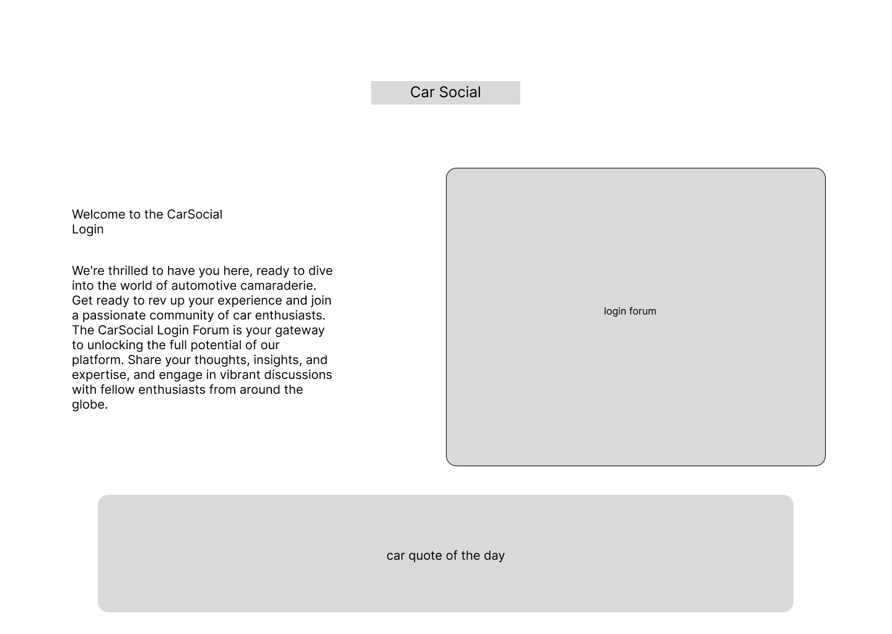
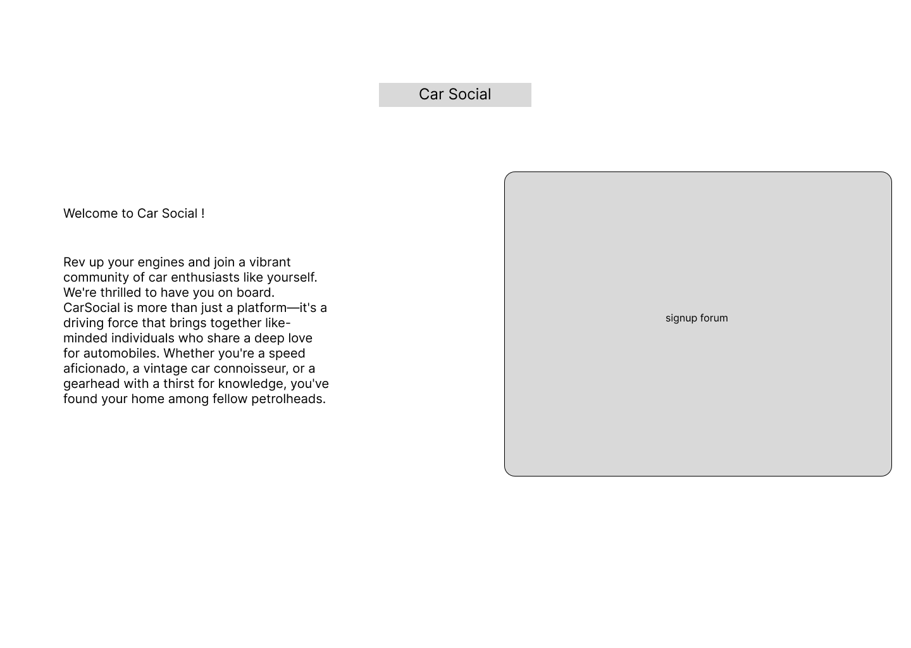

# PROJECT 2

- **Project Name:** Car Social
- **Project By:** Abanob Morkos
- [**LINK TO GITHUB**](http://www.github.com)
- [**LINK TO DEPLOYED WEBSITE**](http://www.render.com)
- **List of Technologies used:** HTML, JS, CSS, Node, Express, EJS, Mongo , jQuery , Figma.
- [**LINK TO TRELLO**](http://www.render.com)

## Description

Car Social is a web application that looks to connect car enthusiasts and share their passion with one another, Users are able to do the following:

- Users are able to post their car with whatever desired modifications 
- Users are able Engage in discussions and share experiences through the app's discussion forum
- Users are able to plan routes and ride together through the route planner

## Mock UP of UI
    
## List of Backend Endpoints

| ENDPOINT       | METHOD      | PURPOSE |
|----------------|-------------|---------|
|/home           |  GET        | home page |
|/Signup         |  POST       | signup page |
|/Login          |  POST       | Login page |
|/route          |  POST       | Creates a new ridining route |
|/route/:id/edit |  Edit       | Edit a route |
|/route/:id      |  PUT        | Updates the ridining route |
|/route/:id      |  DELETE     | Destroys a ridining route |
|/garage         |  POST       | Adds a new car to your garage |
|/garage/:id/edit|  Edit       | Edits the car in the garage  |
|/garage/:id     |  PUT        | Update the car in the garage |
|/garage/:id     |  DELETE     | Deletes the car in the garage  |

## ERD (ENTITY RELATIONSHIP DIAGRAM)

- [Free ERD Diagram Tool](https://dbdiagram.io/home)